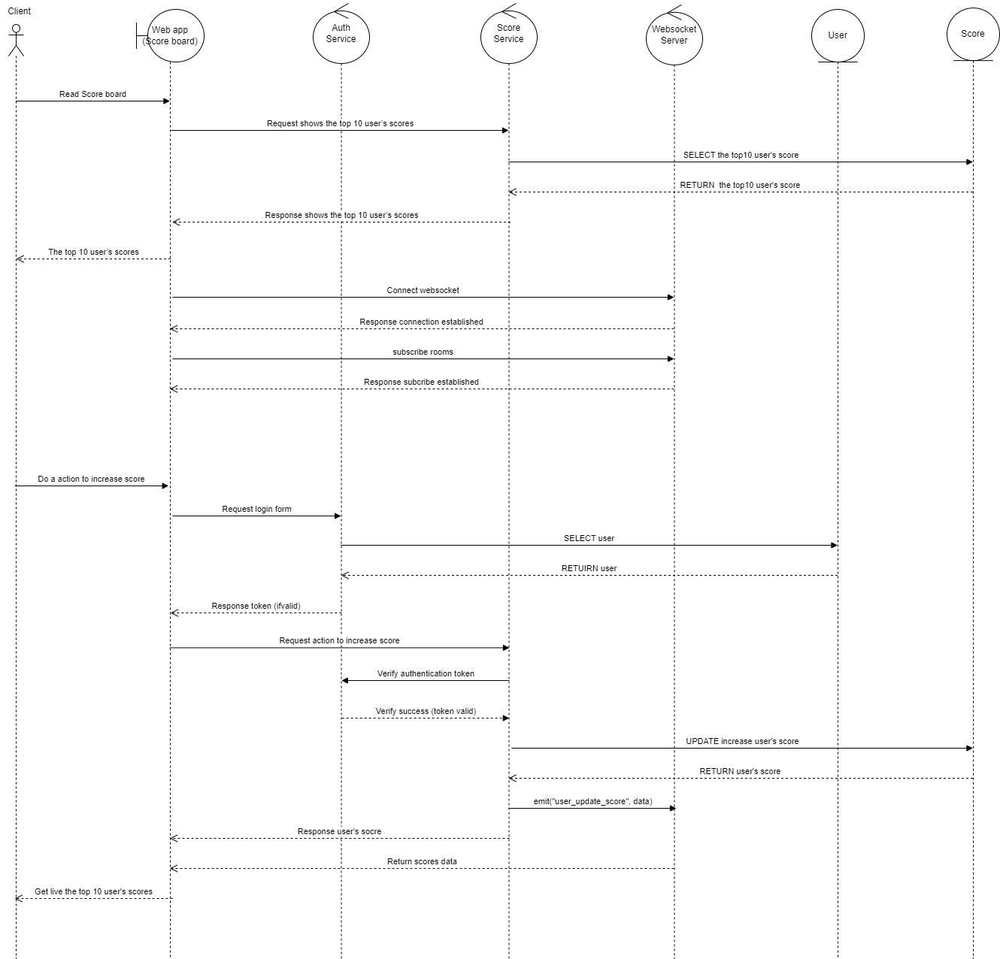

## Design Goals

-   The website (Score board) should show the top 10 user’s scores.
-   Users can do an action to increase the user’s score.
-   Use the web socket for a real-time update of the score board.
-   Authentication service to prevent malicious users from increasing scores without authorization.

## Proposed Solution

### Tech Stack

-   **Website(Frontend, score board):** ReactJs
-   **Auth Service**: ExpressJs framework, JWT authentication (with basic username/password login)
-   **Score Service**: ExpressJs framework, can use Redis to get data.
-   **Socket Server**: Use Socket.io for real-time update score on board.
-   **Database**: PostgreSQL

### API construction

#### Score Service

1.  Get list scores:

    -   Path: `/scores`
    -   Method: `GET`
    -   Params query:

        `orderBy: 'desc`
        `limit: 10`

    -   Response body:

        ```
        [
            {
                "id": "1",
                "name": "user 1",
                "score": 10
            },
            {
                "id": "2",
                "name": "user 2",
                "score": 8
            },
            ...
        ]
        ```

    ```
    curl --location 'http://localhost:8099/api/v1/scores?limit=10'
    ```

2.  Post action(To increase score):

    -   Path: `/scores`
    -   Method: `POST`
    -   Request body:
    -   Response body:

        ```
        {
            "id": "2",
            "name": "user 2",
            "score": 9
        }
        ```

    ```
    curl --location 'http://localhost:8099/api/v1/scores \
    --header 'Content-Type: application/json' \
    --data '{
      "action": "increase"
    }'
    ```

#### Socket Service

1.  Setup socket connection with `socket-io` library.
2.  Setup `update_user_score` topic.

#### Auth Service

1.  Post login API with basic credentials.

    -   Path: `/auth/login`
    -   Method: `POST`
    -   Request body:

        ```
        {
          "username": string,
          "password": string
        }
        ```

    -   Response body:

        ```
        {
          "accessToken": string
        }
        ```

    ```
    curl --location 'http://localhost:8099/api/v1/auth/login' \
    --header 'Content-Type: application/json' \
    --data '{
      "username": "user_1",
      "password": "123456"
    }'
    ```

2.  Verify token API (Internal API)

    -   Path: `/auth/login`
    -   Method: `POST`
    -   Request body:

        ```
        {
          "token": string
        }
        ```

    -   Response body:

        ```
        {
          "valid": true/false
        }
        ```

### Sequence Diagram


